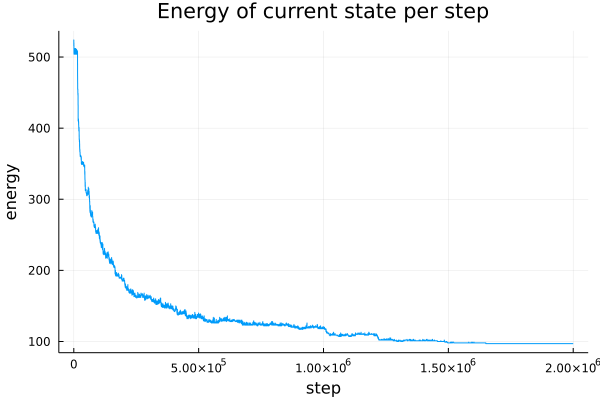

# Time trial optimization
A small exploratory project to evaluate the viability of applying simulated annealing (and maybe other optimization algorithms) to time trial racing games.

Intended features:
- [x] Grid world
- [x] Apply SA to grid world
- [ ] Command line parameters (to switch between envs and supply some parameters for SA)
- [ ] Racing environment
- [ ] Apply SA to racing environment

## Running
- Clone repo
- Open `julia` in root repo directory
- type `] activate .`
- In the REPL run `using TimeTrialOptimization`

## Example graph
Example graph of energy over the course of training:
